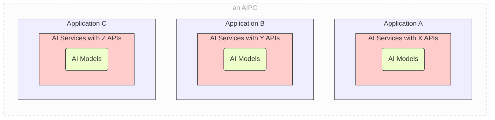

```mermaid
graph TB
  classDef pc_style color:#aaa, fill:#fcfcfc, stroke:#ddd, stroke-dasharray: 5 5
  classDef app_style fill:#eef,stroke:#333
  classDef service_style fill:#fcc,stroke:#333
  classDef model_style fill:#efc,stroke:#333
  app_a:::app_style
  app_b:::app_style
  app_c:::app_style
  ai_service_a:::service_style
  ai_service_b:::service_style
  ai_service_c:::service_style
  pc:::pc_style
  
  subgraph pc[an AIPC]
    direction TB
    subgraph app_c[Application A]
      subgraph ai_service_c [AI Services with X APIs ]
        model1(AI Models):::model_style
      end
    end
    subgraph app_b[Application B]
      subgraph ai_service_b [AI Services with Y APIs]
        model2(AI Models):::model_style
      end
    end
    subgraph app_a[Application C]
      subgraph ai_service_a [AI Services with Z APIs ]
        model3(AI Models):::model_style
      end
    end
  end
```